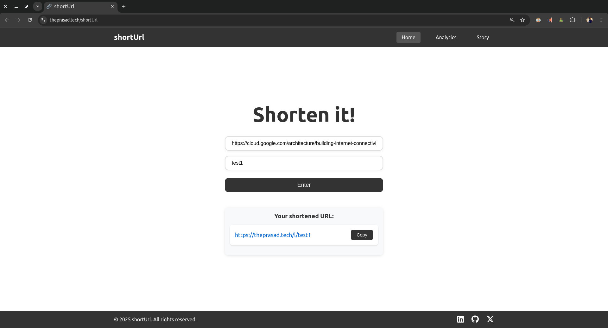

# URL Shortener Service

A modern URL shortening service built with a focus on performance and scalability. This application provides real-time analytics and tracking capabilities through a distributed architecture. The system utilizes Redis caching for quick URL resolutions, Kafka for processing click events asynchronously, and MySQL for persistent storage.

## Overview

The service is designed to handle high-throughput scenarios with features like:
- Efficient URL shortening with customizable slugs
- Real-time click tracking and analytics
- Geographic location detection for each click
- Distributed event processing for analytics
- Cache-first architecture for faster response times
- Scalable database design for URL management

The frontend provides a clean, responsive interface built with React and Vite, while the backend implements a robust microservices-style architecture using Express, Kafka, and Redis.

## Project Architecture

### Frontend Stack
- React with Vite
- React Router DOM
- TypeScript support

### Backend Stack
- Node.js with Express
- Redis for caching and quick URL lookups
- MySQL (Sequelize ORM) for persistent storage
- Apache Kafka for click event processing
- GeoIP-lite for location tracking
- Winston for logging

## Getting Started

### Prerequisites
- Node.js
- Docker and Docker Compose
- npm/yarn

### Infrastructure Setup

1. Clone the infrastructure repository:
```bash
git clone https://github.com/prasadborse02/docker-short-url-setup.git
cd docker-short-url-setup
```

2. Start the infrastructure services:
```bash
docker-compose up -d
```

This sets up:
- Redis server (port: 6379)
- MySQL database (port: 3306)
- Apache Kafka (port: 9092)
- Zookeeper (port: 2181)

### Application Setup

1. Frontend:
```bash
cd frontend
npm install
npm run dev    # Runs on default Vite port
```

2. Backend:
```bash
cd backend
npm install
npm start      # Runs on port 3000
```

### Configuration

Frontend (.env):
```properties
VITE_API_URL=http://0.0.0.0:3000
```

Backend (.env):
```properties
PORT=3000
REDIS_URL=redis://localhost:6379
KAFKA_BROKERS=localhost:9092
DB_HOST=localhost
DB_USER=your_user
DB_PASS=your_password
DB_NAME=shorturl
```

## API Documentation

### URL Operations

#### Create Short URL
- **POST** `/api/shorten`
  ```json
  {
    "url": "https://example.com",
    "requestCode?": "custom-name"
  }
  ```

#### Access Short URL
- **GET** `/api/l/:shortCode`
  - Redirects to original URL
  - Tracks analytics
  - Uses Redis cache

#### Analytics
- **GET** `/api/analytics`
  - Returns click statistics
  - Geographic data
  - Temporal analytics

#### Health Check
- **GET** `/api/ping`
  - Returns `{"message": "pong"}`

## Architecture Features

### Performance Optimizations
- Redis caching for frequent URLs
- Event-driven architecture using Kafka
- Efficient data persistence with MySQL

### Dependencies

**Frontend Packages:**
- React v19
- React Router DOM v7
- Vite v6

**Backend Packages:**
- Express
- Sequelize
- Redis v4
- Kafka.js
- Winston
- GeoIP-lite

## Screenshots

### Front Page


### Implementation


### Analysis Tab

